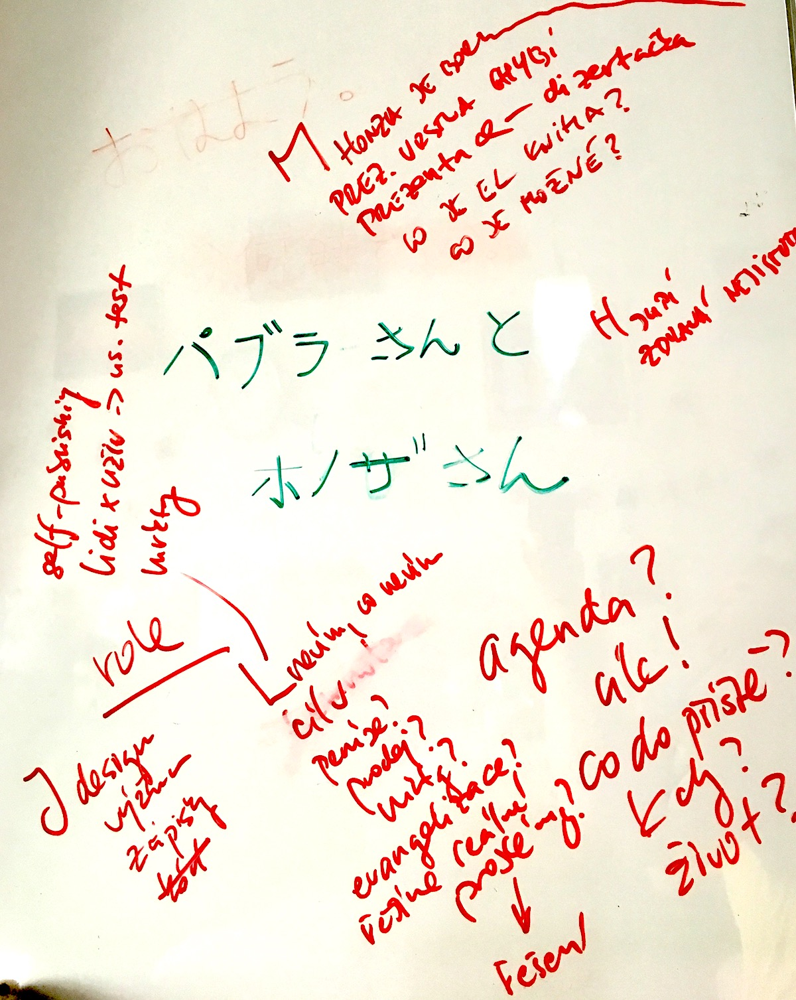
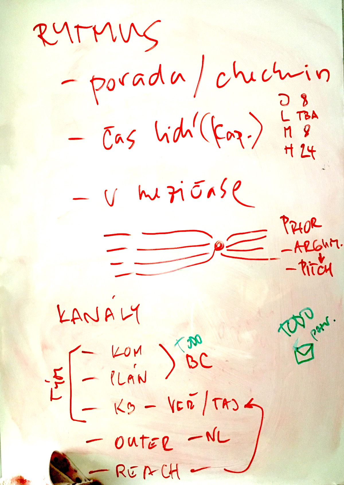

# Intro and expectations

### Expectations

- Lukáš: I still don’t know, what I don’t know: what’s needed, what are the goals? (funding, marketing, sales, evangelization, problem/solution verification?)
- Matěj: what is a digital text? unsure what’s possible in the context of next-book
- Honza: building a healthy and sustainable work env, introing others into a project, needs a lot of idea verification

### Roles

- Josef: research, documentation, no coding
- Lukáš: marketing, user testing, self-publishing outreach
- Matěj: presentation layer, finding visual design for a digital book (part of my dissertation)

### Environment and rhythm

- All-team meeting every other friday (next: October 11, 9am)
- Time allocation (per week): Honza 24h, Josef 8h, Matěj 8h
- KB on the web (**this 😉**), set up by Honza
- team communication and planning on Basecamp, set up by Josef
- bi-weekly newsletter (after every all-team meetup)

### Three areas

- books (prototyping, publishing — own, agency model)
- platform (design, development, documentation)
- collaboration (networking, partnerships, projects)

### Todos

- prep KB (Honza)
- prep Basecamp (Josef)
- decide time allocation (Lukáš)
- next-book pitch generator (Honza + feedback from all)
- prep newsletter (Honza)

## Whiteboard

